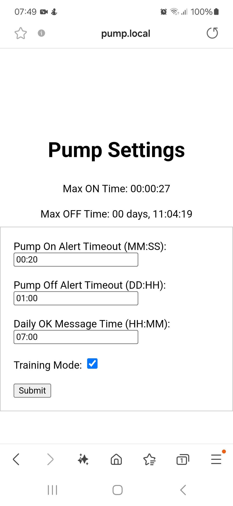
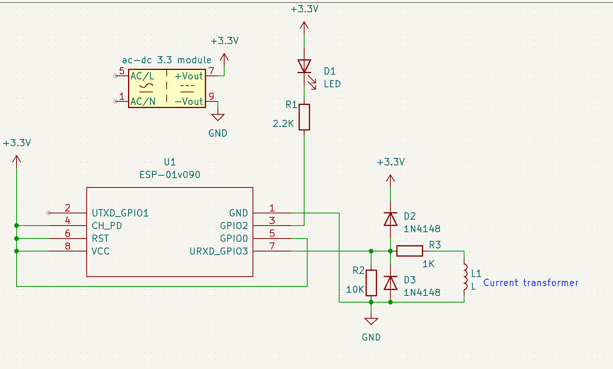
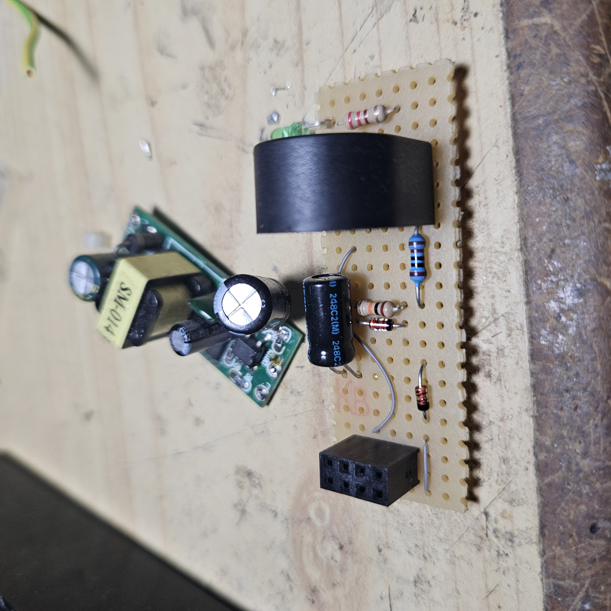
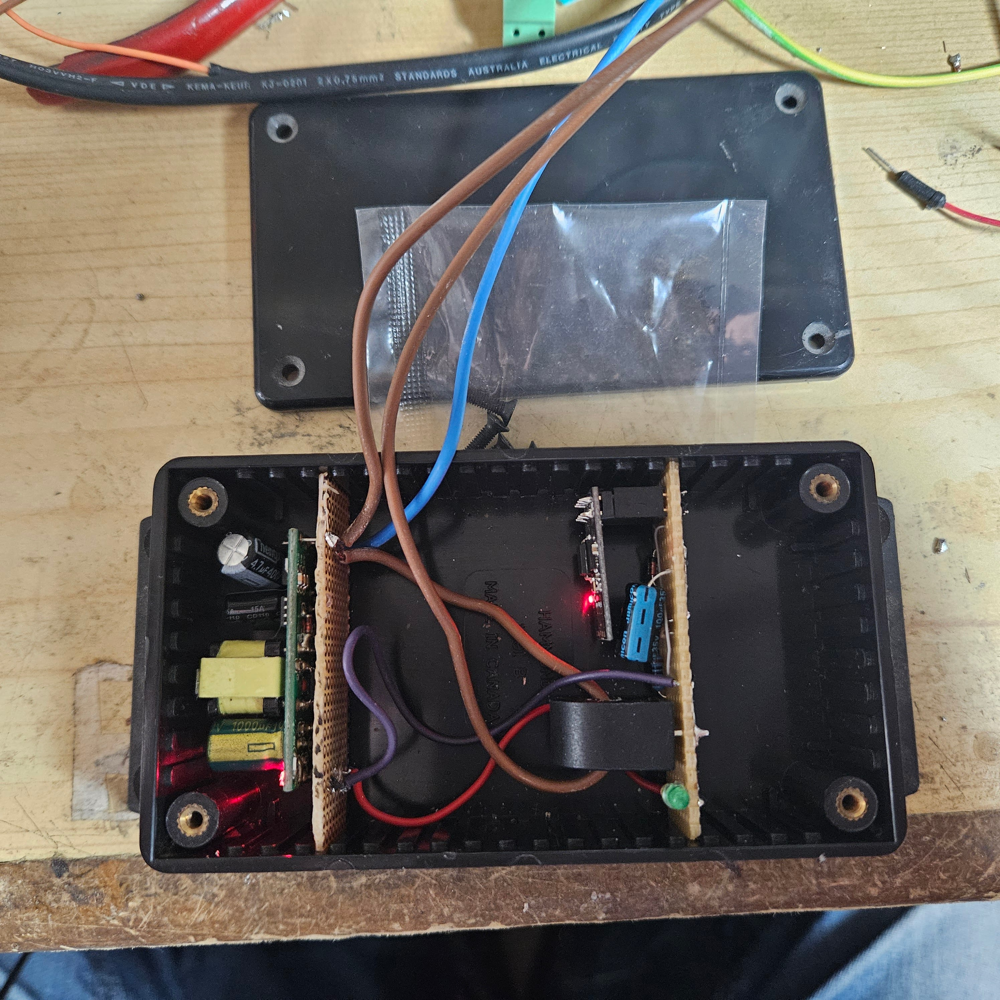

# Pump Alert System

## Description
This project is designed as a monitoring and alert system for water pumps, which are activated by water level switches to drain excess water and deactivated when water levels are low. It employs an ESP01 microcontroller with a current transformer coil to tsample current of the pumps. This setup helps identify operational irregularities such as excessive running times or prolonged periods of inactivity, which could signify problems like a disconnected pipe or a malfunctioning pump. Alerts are sent via Telegram.

## Features

- **Current Monitoring**: Uses a current transformer to monitor the electricity usage of the pump.
- **Configurable Alerts**: Users can set maximum run times and downtime through a web interface.
- **Daily Status Updates**: Sends daily "All OK" messages if the system is functioning normally.
- **Telegram Notifications**: Alerts are sent via the Telegram API, allowing for real-time notifications.
- **Web Interface**: A webpage is created at `pump.local` if mDNS is enabled, and can also be accessed via the device IP, which is sent to Telegram after power up.

## What You Need

1. A small AC to DC 3.3V module
2. An ESP01 microcontroller
3. A current transformer coil
4. Two diodes, a capacitor, and  two resistors as per the schematics provided below:

## :warning: Warning
**WARNING:** This project involves working with mains voltage, which can be hazardous. It should only be attempted by professionals who have the necessary knowledge and experience in handling high voltage electrical systems. Ensure all safety protocols are followed to prevent any risk of injury or damage.

### Disclaimer
*The information provided in this document is for educational purposes only. Anyone using this information does so at their own risk. The author or publisher of this document assumes no responsibility for any injuries or damage that may occur.*

## Assembly
Assembly is rather non-critical; just make sure your power supply is well away from the low voltage electronics. Here is how I did it:

### Software Setup
1. Clone this repository to your local machine.
2. Open the project with PlatformIO or your preferred IDE.
3. Insert your WiFi credentials, Telegram bot token, and chatID in the designated sections of the code.
4. Upload the code to the ESP01 using PlatformIO or through the Arduino IDE configured for ESP8266.

## Configuration
- Access the pump's web interface provided by the ESP01 via WiFi.
- Set the maximum allowed run time and downtime for the pump.
- Configure the time for the daily operational check message.

## Usage
Once installed and configured, the system will monitor the pump's activity. Alerts will be sent through Telegram if:
- The pump runs longer than the set maximum time.
- The pump hasn't activated after the set maximum downtime.
- A daily check (if everything is normal) will be sent at the specified time.

## Contributing
Contributions to this project are welcome. Please fork this repository, make your changes, and submit a pull request for review.

## License
This project is licensed under the MIT License - see the [LICENSE.md](LICENSE) file for details.

